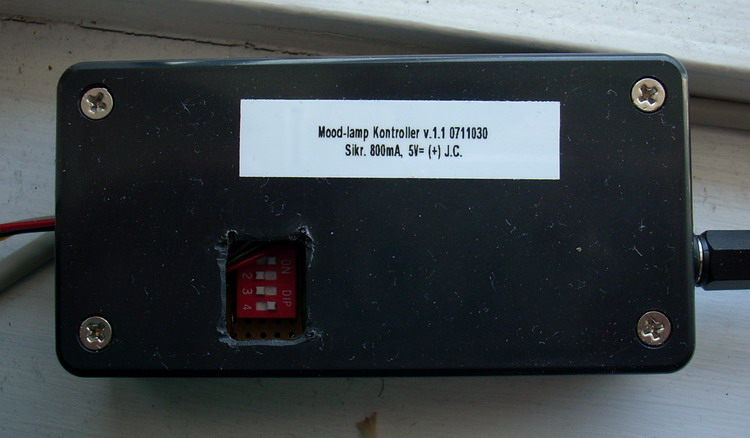

## Source code for project: [Mood light controller](https://link.stdout.no/A)

Turn any RGB LED into a mood-lamp with this controller. Uses an AVR ATmega8 microcontroller.

Written in basic, using [Bascom-AVR](http://www.mcselec.com/).

### Author
[Thomas Jensen](https://thomas.stdout.no)
